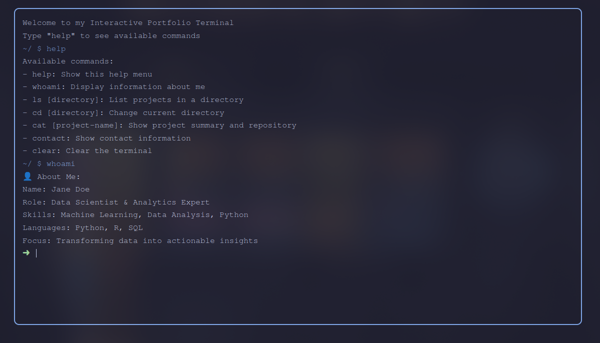

# Terminal Portfolio

A unique, interactive command-line interface portfolio website built with HTML, CSS, and JavaScript. Experience a nostalgic terminal-like interface showcasing projects and personal information through familiar command-line commands.

 <!-- You should add a screenshot of your project -->

## Features

- **Interactive Terminal Interface**: Realistic terminal-like experience
- **Command-Line Navigation**: Browse projects and information using familiar Unix commands
- **Project Showcase**: Organized display of projects in different categories
- **Catppuccin Mocha Theme**: Beautiful, eye-friendly color scheme

## Commands

- `help` - Display available commands
- `whoami` - Show personal information
- `ls [directory]` - List projects in a directory
- `cd [directory]` - Change current directory
- `cat [project-name]` - Show project details
- `contact` - Display contact information
- `clear` - Clear the terminal (also works with ctrl+l)

## Technologies Used

- HTML5
- CSS3
- Vanilla JavaScript
- Catppuccin Mocha Color Palette

## Getting Started

1. Clone the repository:

```bash
git clone https://github.com/yourusername/terminal-portfolio.git
```

2. Open `index.html` in your web browser

## Customization

To customize the portfolio with your information:

1. Modify the `projects` object in the JavaScript code to add your projects
2. Update the `contacts` object with your contact information
3. Customize the `showAboutMe()` function with your personal information
4. Adjust the color scheme in the CSS variables if desired

## 📝 Project Structure

```
terminal-portfolio/
├── index.html
├── LICENSE
└── README.md
```

## Contributing

Contributions, issues, and feature requests are welcome! Feel free to check the [issues page](https://github.com/ratludu/terminal-portfolio/issues).

1. Fork the project
2. Create your feature branch (`git checkout -b feature/AmazingFeature`)
3. Commit your changes (`git commit -m 'Add some AmazingFeature'`)
4. Push to the branch (`git push origin feature/AmazingFeature`)
5. Open a Pull Request

## License

This project is licensed under the MIT License - see the [LICENSE](LICENSE) file for details.
